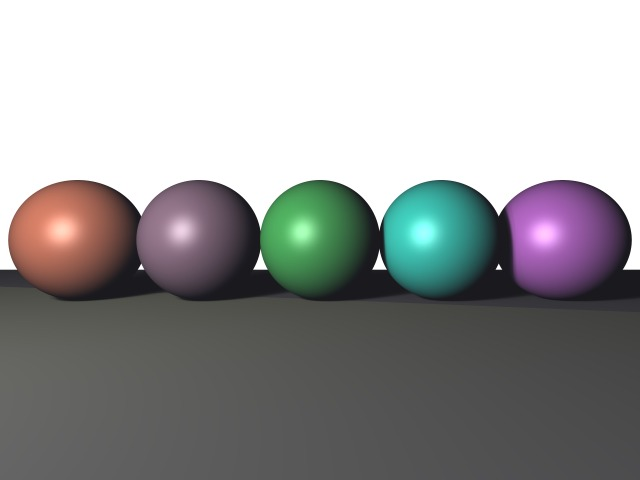

# CSCI596 Final Project

## Authors: Suvi Marathe, Leyu Xu

### Intro: What is Ray Tracing?
Ray tracing is one of the techniques for global illumination in the field of Computer Graphics. In Computer Graphics, global illumination refers to a set of 3D lighting algorithms 
that are capable of not only simulating the light coming directly from a light source but also those reflected off other surfaces in the scene. The concept of global illumination 
exists in contrast to local illumination, in which only the light coming directly from a light source is simulated. In a nutshell, ray tracing algorithm, in its simplest form, allows 
a 3D object in the scene to cast shadow on another 3D object.  
  
*A 3D Scene Produced by Our Ray Tracer*

### Basic Science of Ray Tracing
The basic science of ray tracing without any mathematics is explained as follows. First of all, we have a very simple 3D scene where we have different objects such as spheres and triangles 
in addition to a point light source. Then, a camera is positioned in the scene where we want our eyes to be looking. Subsequently, let's imagine a plane (or a computer monitor) in front 
of the camera on which the image of the scene will be generated. This plane will be divided to many small grids (or pixels), and through each grid, we will fire a ray from the camera position. 
If this ray does not hit any object in the scene, the grid (pixel) it came from will be colored whatever default color that we assigned. However, if this ray does hit an object, another ray will 
be fired from the hit point towards the point light source. If this second ray reaches the light source without hitting any other objects, then we know that the hit point is not blocked by any 
other objects and its color should be evaluated based on its material property and the color of the light source. Yet, if the second ray hits some other object along the way, then we know that 
the hit point is blocked from the light source, and is therefore not lighted (its corresponding pixel will be completely black with only a single point light source).  
  
*A Diagram for Ray Tracing Excerpted from NVIDIA's official website*  

