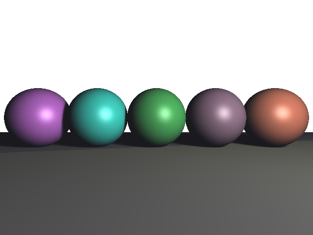
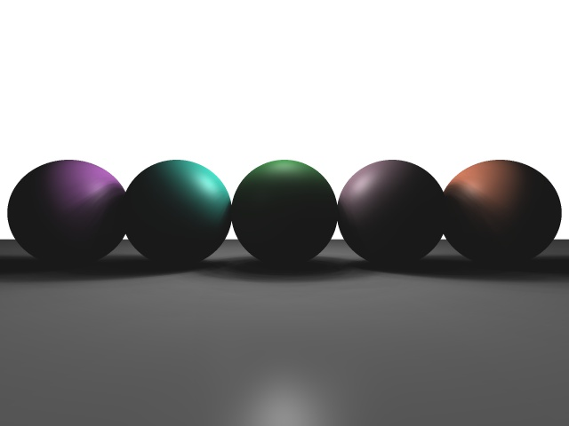
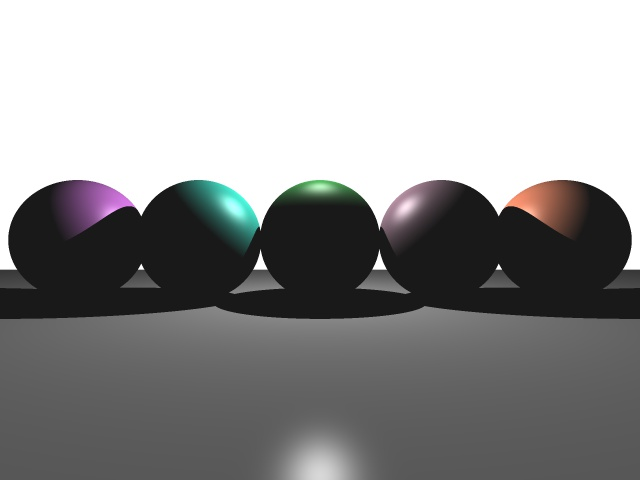
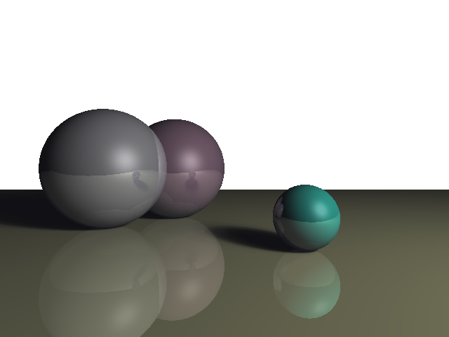
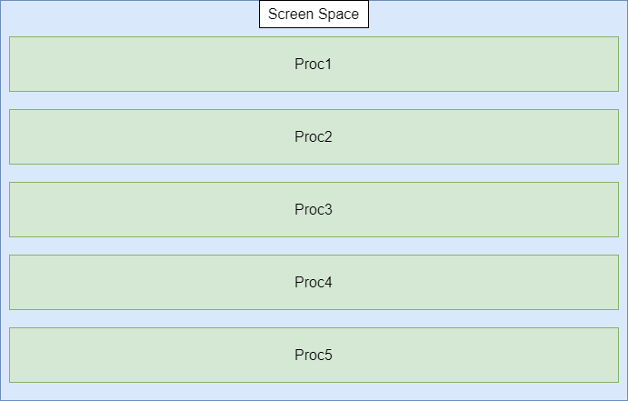
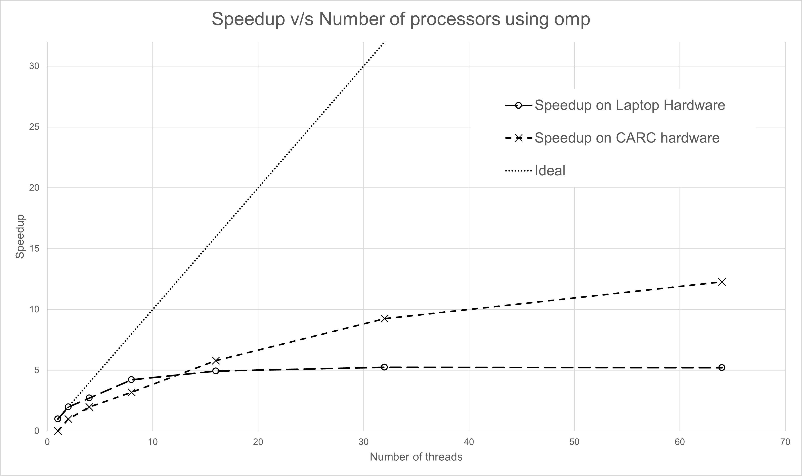
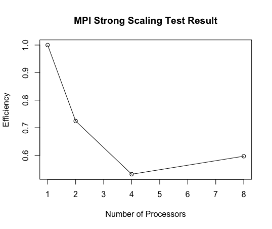

# CSCI596 Final Project: Parallel Ray Tracer

## Authors: Suvi Marathe, Leyu Xu

### Intro: What is Ray Tracing?
Ray tracing is one of the techniques for global illumination in the field of Computer Graphics. In Computer Graphics, global illumination refers to a set of 3D lighting algorithms 
that are capable of not only simulating the light coming directly from a light source but also those reflected off other surfaces in the scene. The concept of global illumination 
exists in contrast to local illumination, in which only the light coming directly from a light source is simulated. In a nutshell, ray tracing algorithm, in its simplest form, allows 
a 3D object in the scene to cast shadow on another 3D object.  
  
*A 3D Scene Produced by Our Ray Tracer*

### Basic Science of Ray Tracing
The basic science of ray tracing without any mathematics is explained as follows. First of all, we have a very simple 3D scene where we have different objects such as spheres and triangles 
in addition to a point light source. Then, a camera is positioned in the scene where we want our eyes to be looking. Subsequently, let's imagine a plane (or a computer monitor) in front 
of the camera on which the image of the scene will be generated. This plane will be divided to many small grids (or pixels), and through each grid, we will fire a ray from the camera position. 
If this ray does not hit any object in the scene, the grid (pixel) it came from will be colored whatever default color that we assigned. However, if this ray does hit an object, another ray will 
be fired from the hit point towards the point light source. If this second ray reaches the light source without hitting any other objects, then we know that the hit point is not blocked by any 
other objects and its color should be evaluated based on its material property and the color of the light source. Yet, if the second ray hits some other object along the way, then we know that 
the hit point is blocked from the light source, and is therefore not lighted (its corresponding pixel will be completely black with only a single point light source).  
  
*A Diagram for Ray Tracing Cited from NVIDIA's official website*  

### Our Core Implementations
#### Ray-Sphere Intersection & Ray-Triangle Intersection
At the heart of our ray tracer lies the intersection algorithm between the ray itself and other 3D objects. Since spheres and triangles are some of the most common 3D objects, we are interested in 
developing algorithms that can check ray-sphere and ray-triangle intersections. For the ray-sphere intersection algorithm, the basic idea is very simple. Imagine the center of the sphere being 
a point, and what we want to know is whether the closest distance between any point on the ray and the center of the sphere is less or equal to the radius of the sphere. If it is, then we know that we 
have at least one intersection (usually we have two, one coming into the sphere and one going out). Then, with some more mathematical efforts, we're able to get the exact positions of the intersections 
and our algorithm will choose the closest one to return as the result.  
  
*A Diagram for Ray Sphere Intersection Cited from Scratchapixel 3.0*  

When it comes to the ray-triangle intersection algorithm, things would get a bit more complicated. First of all, the algorithm will calculate if the ray intersect with the plane on which the triangle 
resides. If it does, then the algorithm will calculate the **barycentric coordinates** of intersection point. A set of barycentric coordinates expresses the intersection point as a combination of the three 
vertices of the triangle using the subarea ratios of the sub-triangles formed by the intersection point and any two vertices. If all three values of the barycentric coordinates are between 0 and 1, then we 
know that the point falls into the triangle.  
  
*A Diagram for Ray Triangle Intersection Cited from MathWorks*  

#### Anti-aliasing (Super-sampling AA vs. Random-sampling AA)
In Computer Graphics, aliasing refers to the visual artifacts that affect the quality of the images. In our particular case of ray-traced images, aliasing is presented as sharp step-like outlining of the 
rendered 3D objects. Aliasing occurs primarily because of insufficient sampling of the high-frequency details in the scene. The same concept lies behind Nyquist Theorem, a famous theorem in digital signal processing 
that states the relation between sample rate and signal bandwidth. The address aliasing, we have come up with 2 anti-aliasing (AA) algorithms. The first method is called super-sampling AA, in which each grid in front 
of the camera position is subdivided into many smaller grids, and a ray is fired through each subdivided grid. The final result of the original grid will be the average of the colors given by all the subdivided grids. 
This method is kind of a brute-force approach. It yields high-quality result but is more time-consuming. An alternative method we have come up with is the Random-sampling AA, in which we fire multiple rays through a 
grid such that their directions are distributed as a normal distribution. This method runs faster under equivalent hardware but produces more aliasing compared to super-sampling AA. We're currently still experimenting 
with these methods to try to find an equilibrium.  
  
*3D Scene Produced by SSAA*  
  
*3D Scene Produced by Random AA*  

#### Soft Shadow
In reality, we will never have an actual point light source. Therefore, the shadows we observe will never have outlines as harsh as those produced by point light ray-tracing simulations. In order to render as 
realistically as possible, we have developed a simple method to produce soft shadows in our ray tracer. Basically, for every point light source, we subdivide the it into many point light sources that form 
a normal distribution around the original light source, with intensity divided by the number of subdivisions. This way, we are roughly simulating an area light with sufficiently large number of subdivisions.  
  
*3D Scene Produced with Soft Shadow On*  
  
*3D Scene Produced with Soft Shadow Off*  

#### Recursive Ray Tracing
To even more realistically render a scene, we may also want to account for multiple bounces of a light beam across multiple objects. To this end, we can utilized a method named recursive ray tracing. The basic 
idea is that when a ray from the camera position hits an object, we also want to fire another reflection ray off the hit point. If this reflection ray hits another object in the scene, then we know that the light 
reflected off that object will also contribute to the lighting of this object. We can repeat this process as many times as we want as long as the computational cost is reasonable. The result of recursive ray tracing 
is shown below, where you can see sort of a mirror surface on the objects.  
  
*3D Scene Produced with Recursive Ray Tracing*  

### Plan for Parallalization
To parallelize our algorithm, we will be experimenting with MPI and OpenMP for implementing parallel + multithreaded CPU ray tracer. Since the result of each pixel in a ray traced image is calculated independently from one 
another, we will experiment with various patterns of dividing the screen space. We are curious to explore whether different ways of screen divisions will significantly impact the runtime of the algorithm, probably due to 
cache read and misses. A disadvantage of the above approach is that if the scene is sparse, some threads return early and remain idle while the others have to do a majority of the work.
To address this, we also want to explore a worker queue model which would have higher overhead but we expect it would do better.
We will conduct scalability tests on our final product and plot the graphs for examining the efficiency.
  
*Dividing the Screen Space into Horizontal Strips*  

### Results
#### Using OMP (implemented by Suvi Marathe on suvi-test branch)
We used the omp parallel directive with the collapse modifier allowed us to mark the outer two loops as the ones to be parallelized. This makes the computation for each pixel to be treated as one job. This populates the job pool from which the worker threads fetch jobs to work on. One advantage with this is that every thread works on a different pixel and there is no cross communication of information required between jobs. This enables the worker threads to directly store their result into the main buffer allowing us to skip the expensive copy step without worrying about race-conditions or memory corruption.
##### Strong-Scaling Tests
For Strong Scaling, we took a fixed problem-size, a 960x540 pixel render with 10xSSAA, Soft shadows and a Recursive Depth of 3 reflections. We ran it on 2 machines, once on my Laptop with an i7-8750H supporting 12 threads and once on a USC CARC machine with xeon-2640v4 processor supporting 20 threads per node.
  

We see that the results do follow Gustafson's law and law of depreciating returns. The weaker laptop hardware flattens out at around a 5 times speedup. It is interesting to notice that there is no improvement moving from 32 to 64 threads because the CPU does not have enough physical threads to support that level of parallelism. The CARC node on the other hand does have improved performance for every step in threadcount.

#### Using MPI (implemented by Leyu Xu on leyu-test branch)
We also used MPI as learned in class to run parallel CPU ray tracing with CARC's computing nodes. In particular, we divided the screen space into horizontal strips and had each processor process one strip. Among all the running processes, one of them is designated as the manager process that will be responsible of receiving results from other processes and outputing the final image, while the rest will only serve as worker processes that fill out and send their assigned strips. The main MPI commands used in the implementation are MPI_Recv and MPI_Send.  
#### Strong-Scaling Tests
The strong scaling test is conducted on USC CARC's computing node with xeon-2640v4 processors. The image rendered was of size 640x480 pixels, with 10x SSAA, soft shadow off and recursive reflections off. The resulting plot is shown below:  
  

Similar to the scalability test with multi-threading, the efficiency gradually decreases as the number of processors increases. Interestingly, the efficiency actually increases as the number of processors jumps from 4 to 8. We suspect that this is due to other jobs on CARC running at the same time as ours or caching changes with 8 processors.  

### Contributions
#### Suvi Marathe: ray tracing code, object-oriented designs, image I/O, OpenMP implementation and testings, readme write-up
#### Leyu Xu: ray-object intersection algorithms, MPI implementation and testings, image I/O, readme write-up